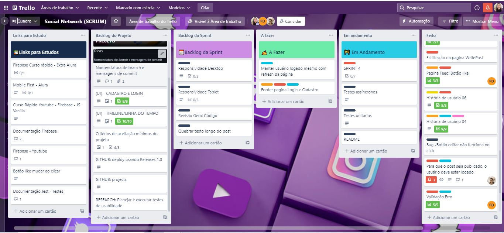

<h1 align = "center"> Good Food - Criando uma Rede Social
</h1>
<div align = "center">
  

</div>

## Índice

* [1. Sobre](#1-sobre)
* [2. Acesso](#2-acesso)
* [3. Pré-requisitos para instalação](#3-pré-requisitos-para-instalação)
* [4. Definição de produto](#4-definição-de-produto)
* [5. Planejamento](#5-planejamento)
* [6. Histórias de usuário](#6-histórias-de-usuário)
* [7. Protótipos](#7-protótipos)
* [8. Testes de usabilidade](#8-testes-de-usabilidade)
* [9. Features](#9-features)
* [10. Tecnologias utilizadas](#10-tecnologias-utilizadas)
* [11. Pessoas desenvolvedoras](#11-pessoas-desenvolvedoras)

***
## 1. Sobre

Há redes sociais para todos os tipos de interesse, e neste projeto, pensamos naquelas pessoas que adoram comer bem, mas que não abrem mão de ter boas recomendações antes de decidir visitar um restaurante ou fazer um pedido da comida preferida.

O objetivo principal de aprendizagem foi construir uma [Single-page Application
(SPA)](https://pt.wikipedia.org/wiki/Aplicativo_de_p%C3%A1gina_%C3%BAnica)
[_responsiva_](https://curriculum.laboratoria.la/pt/topics/css/02-responsive) (com mais de uma tela/ página) na qual seja possível ler e escrever dados.


## 2. Acesso

O deploy do projeto foi realizado pelo Git Pages. [Clique aqui]( ) para acessá-lo.
## 3. Pré-requisitos para instalação

Antes de começar, você vai precisar ter instalado em sua máquina as seguintes ferramentas: [Git](https://git-scm.com), [Node.js](https://node.js.org/en/), e editor de código como por exemplo o [VSCode](https://code.visualstudio.com/).
### Rodando o projeto
```bash
# Clone este repositório
$ git clone <https://github.com/GabrielaMedrado/SAP007-social-network.git>
# Acesse o repositório do projeto pelo terminal/cmd
$ cd SAP007-social-network
# Instale as dependências
$ npm install
# Eecute a aplicação em modo de desenvolvimento
$ npm start

# O servidor iniciará na porta:3000 - acesse <http://localhost:3000>
```
## 4. Definição de produto

Tendo em vista que os consumidores hoje, têm muitas opções de escolha na hora visitar um restaurante ou fazer o pedido da sua comida preferida pela internet, mas que preparar uma boa refeição em casa também virou uma mania nacional, decidimos que o tema seria voltado para gastronomia e criamos um formulário com algumas perguntas que nos ajudaram a definir o foco da nossa Rede Social.
### Pesquisa 

Entrevistamos 41 pessoas e a maioria mostrou interesse em fazer parte de uma rede social onde fosse possível compartilhar dicas e ter recomendações de estabelecimentos gastronômicos.

* **Sobre o interesse pelo tema:** 85,4% dos entrevistados informaram que costumam fazer pesquisas na internet sobre receitas e estabelecimentos gastronômicos.


* **Sobre o foco da Rede Social:** 75,6% dos entrevistados informaram que fariam parte de uma rede social com dicas de estabelecimentos gastronômicos.


## 5. Planejamento

O planejamento das tarefas foi realizado no Trello. [Clique aqui](https://trello.com/b/8XGRRl7U/social-network-scrum) para acessá-lo.

Primeiro separamos um card para cada história de usuário e nele inserimos os checklists das atividades necessárias para sua conclusão. Depois fomos "quebrando" essas atividades em pequenas tarefas e etiquetando de acordo com a Sprint e História de usuário. A medida que cada tarefa era concluída, transferíamos os cards para a aba de "Feito" e assim fizemos também com os cards das Histórias de usuário que estavam sendo concluídas.

Mantivemos as abas "Backlog do Projeto" e "Links para Estudo" sem alterações para nos certificarmos de executar todas as funcionalidades propostas para o aceite do projeto. 



## 6. Histórias de usuário

As histórias de usuário representam tudo que o usuário pode fazer/ver na Rede Social. Cada uma delas tem os critérios de aceitação e a definição de pronto.


* **História de usuário 01:** Como usuário quero me cadastrar em uma rede social para visualizar dicas de estabelecimentos gastronômicos. 

_Critérios de aceitação_: Ao entrar na aplicação, o usuário poderá escolher dinamicamente entre se logar diretamente caso já tenha uma conta, ou se cadastrar. Na página "Cadastre-se", poderá inserir nome, e-mail e senha, e clicar no botão "Cadastrar".

_Definição de pronto_: O usuário só conseguirá se cadastrar se preencher todos os campos corretamente, com nome, e-mail e senha.


* **História de usuário 02:** Como usuário da rede social quero fazer o login com a conta do google para visualizar dicas de estabelecimentos gastronômicos. 

_Critérios de aceitação_: Ao entrar na aplicação, o usuário poderá se logar diretamente com a conta do google.

_Definição de pronto_: O usuário só conseguirá se logar através de uma conta do google válida, clicando no botão "Fazer login com o Google"  


* **História de usuário 03:** Como usuário da rede social quero fazer o login para visualizar dicas de estabelecimentos gastronômicos. 

_Critérios de aceitação_: Ao entrar na aplicação, o usuário poderá escolher dinamicamente entre se logar caso já tenha uma conta, ou se cadastrar. Na página "Conecte-se", poderá inserir e-mail e senha, e clicar no botão para se logar.

_Definição de pronto_: O usuário poderá se logar através de um e-mail e senha já cadastrados, e em seguinda clicando no botão "Entrar".


* **História de usuário 04:** Como usuária de rede social, eu gostaria de fazer uma postagem. 

_Critérios de aceitação_: Para que o post seja publicado, o usuário deve estar logado. Ele deve clicar no ícone de compartilhar na página do feed e depois escrever uma mensagem que será publicada também no feed. 

_Definição de pronto_: criamos uma função que garante que apenas usuários logados possam publicar mensagens. Outra função foi criada para que essas mensagens fossem enviadas ao banco de dados. E mais outras duas funções foram necessárias para ler os posts do banco e mostrá-los na tela. Ao recarregar a página, a aplicação identifica o usuário logado e o mantém com acesso à aplicação.


* **História de usuário 05:** Como usuária de rede social, eu quero poder editar ou deletar a minha postagem.

_Critérios de aceitação_: deverá haver as opções de editar ou deletar post somente se o post for de autoria do usuário.

_Definição de pronto_:  ao encontrar um post de sua autoria, o usuário verá as opçoes de editar e deletar abaixo da publicação. Ao clicar no ícone de editar, o campo da publicação se tornará editável e o usuário pode fazer a sua modificação e clicar no ícone "check" para salvar a alteração. Da mesma forma, haverá o ícone de deletar o post. Ao clicar no ícone de deletar, aparecerá uma mensagem de confirmação onde o usuário poderá clicar em sim ou não para deletar seu post. Para atender a essa demanda, colocamos essas duas funções numa condição para aparecerem somente nos posts criados por seus respectivos autores.


* **História de usuário 06:** Eu como usuária de rede social gostaria de poder curtir as postagens dos meus amigos. 

_Critérios de aceitação_: ao ingressar na página do feed, o usuário deverá ter a opção de curtir todas as publicações que aparecerem. O usuário poderá curtir cada publicação apenas uma vez. Se ele clicar novamente em uma publicação já curtida por ele, ele vai desfazer a ação. O usuário também visualizará a contagem de likes.

_Definição de pronto_:  foi criada a função "like" que está disponível em todas as publicações do feed, independentemente de ser ou não do usuário logado. Para curtir, o usuário deve clicar no ícone de coração e ele mudará de cor, indicando que já foi curtido pelo usuário. Foi criada a função "dislike" para quando o usuário curtir a mesma publicação, desfazer a ação do like. O usuário visualizará a contagem de likes ao lado do ícone de coração.

### 7. Protótipos

Utilizamos o Figma para desenhar o protótipo de alta fidelidade. O desenho abaixo demonstra o fluxo que será encontrado pelo usuário ao acessar a aplicação.


## 8. Testes de usabilidade

Após alguns testes de usabilidade, algumas funções que não estavam no escopo inicial foram adicionadas no projeto. Abaixo iremos descrever o que motivou e quais foram essas modificações.

- Ao clicar no ícone para dar likes, a contagem de likes aumentaria, mas não era visível para o usuário que ele havia curtido tal publicação. Para resolver isso, inserimos uma função que faz com que o ícone mude de cor para vermelho assim que o usuário dá o like, e volta para transparente quando ele desfaz a ação.

- Os usuários também acharam viável ter mais dois campos para inserir cidade e nome do estabelecimento ao fazer uma publicação. Inserimos estes campos e agora ao clicar em compartilhar, mais dois inputs são abertos indicando que ele deve preencher esses campos, além da mensagem em si.

- A cor de fundo de todas as páginas inicialmente foi um amarelo claro, retirado da paleta de cores que foi resultado do nosso logotipo, porém, muitos usuários apontaram que mesmo uma cor clara, torna a visualização cansativa. Decidimos então deixar a cor padrão branca para resolver esse problema.
## 9. Features

- [x] **Criar usuário com nome, e-mail e senha**
- [x] **Fazer login com e-mail e senha**
- [x] **Fazer login com o Google**
- [x] **Criar publicações**
- [x] **Editar publicações**
- [x] **Deletar publicações**
- [x] **Curtir publicações**

## 10. Tecnologias utilizadas

- **HTML**
- **CSS**
- **Javascript**
- **Firebase**
- **Firestore**
- **Firebase Auth**

## 11. Pessoas desenvolvedoras

Este projeto foi desenvolvido durante o Bootcamp da Laboratória, Turma 007 pelas colaboradoras: 

- [Flavia Dantas](https://www.linkedin.com/in/flavia-dantas/)


- [Gabriela Medrado](https://www.linkedin.com/in/gabrielamedrado/)


- [Lidianne Barbosa](https://www.linkedin.com/in/lromao/)


